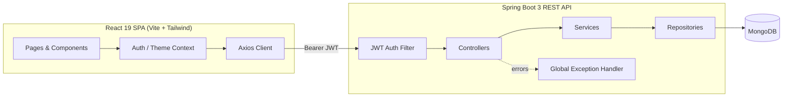
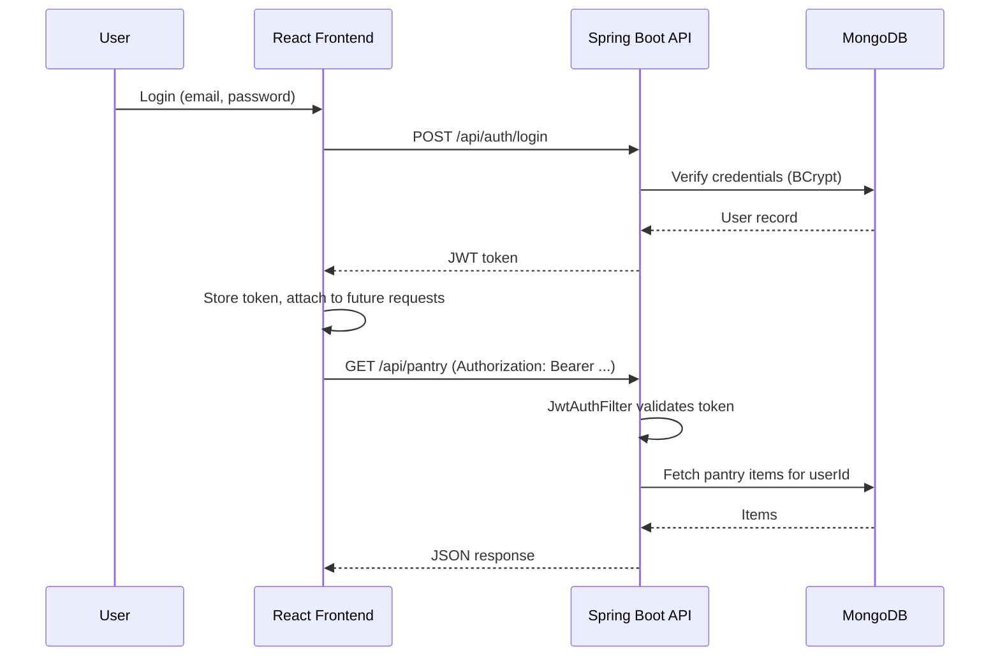

<div align="center">

# 🥑 Smart Pantry
### Grocery & Expiry Management System

A premium, full-stack SaaS-style application for tracking pantry stock, beating expiry dates,
managing shopping lists, and discovering recipes from what's already in your kitchen.

[](https://openjdk.org/)
[](https://spring.io/projects/spring-boot)
[](https://www.mongodb.com/)
[](https://react.dev/)
[](https://vitejs.dev/)
[](https://tailwindcss.com/)
[](https://jwt.io/)
[](./LICENSE)
[](./docker-compose.yml)

[Demo Account](#-demo-account-pre-loaded-data) • [Features](#-features) • [Architecture](#-architecture) • [Quick Start](#-quick-start) • [API](#-api-overview) • [Folder Structure](#-folder-structure) • [Screenshots](#-screenshots)

</div>

---

## 🎓 Demo Account (pre-loaded data)

The app seeds a ready-to-present dataset automatically on first startup — nothing to set up before a demo or presentation.

| | |
|---|---|
| **Email** | `demo@smartpantry.com` |
| **Password** | `Demo@1234` |

The demo account already has:
- **20 pantry items** across every category, including a couple that are **already expired**, several **expiring within the next week**, and two sitting **below their low-stock threshold** — so the Dashboard, expiry alerts, and low-stock widgets all have real data to display immediately.
- **7 shopping list items** with mixed priorities, some already marked purchased.
- **10 starter recipes**, so Recipe Suggestions shows real match percentages against the seeded pantry right away.

Just click **"View Demo Account"** on the login screen (or sign in with the credentials above) and every page — Dashboard, Pantry, Shopping List, Recipes, Analytics — is populated. The seeding logic (`DataSeeder.java`) runs once on first boot and is idempotent: restarting the app won't duplicate or reset the data.

---

## ✨ Features

| Category | Highlights |
|---|---|
| 🥫 **Pantry Management** | Full CRUD for pantry items with category, quantity, unit, storage location, price and notes |
| ⏰ **Expiry Tracking** | Automatic expiry timeline, "expiring within N days" alerts, expired-item detection |
| 📉 **Low-Stock Detection** | Per-item configurable low-stock thresholds with dashboard alerts |
| 🛒 **Shopping List** | Priority-based shopping list; marking an item "purchased" **automatically restocks the pantry** |
| 🍳 **Recipe Suggestions** | Ingredient-matching engine ranks recipes by how much of your pantry they use, and shows what's missing |
| 📊 **Expense Analytics** | Category spend breakdown, monthly spend trend, expiry distribution — all chart-driven |
| 🔐 **Security** | Stateless JWT authentication, BCrypt password hashing, route-level authorization |
| 🎨 **Premium UI** | Glassmorphism cards, dark/light mode, Framer Motion micro-animations, skeleton loaders, toast notifications |
| 🔍 **Data UX** | Search, category filters, sorting, and pagination across Pantry and Shopping List views |
| 🚀 **Single-Run Deploy** | `mvn package -Pbuild-frontend` bundles the React build into the Spring Boot jar — one process, one port |

---

## 🏗 Architecture

**Backend** follows a strict, explicit **Controller → Service → Repository** layering with constructor
injection only — no Lombok, no DTOs, no Mapper classes. Entities are validated with Bean Validation
and used directly as request/response bodies, kept safe via `@JsonIgnore` on sensitive fields (e.g. password).





**Layering inside the backend module:**

```
Controller  →  validates input via @Valid, delegates to Service, maps HTTP status
Service     →  business rules (ownership checks, low-stock/expiry logic, recipe matching)
Repository  →  Spring Data MongoDB interfaces, no custom implementation needed
Entity      →  used directly as the wire format; Bean Validation annotations live here
```

---

## 🚀 Quick Start

### Option A — Docker Compose (recommended, single command)

```bash
docker compose up --build
```

This builds the React app, bundles it into the Spring Boot jar, starts MongoDB, and serves the
**entire application — API + UI — on http://localhost:8080**.

### Option B — Single-run Maven build (no Docker)

```bash
# 1. Start MongoDB locally (or point MONGODB_URI at an Atlas cluster)
mongod --dbpath ./data

# 2. Build the frontend into the backend jar and run it
cd backend
mvn clean package -Pbuild-frontend
java -jar target/smart-pantry.jar
```

Visit **http://localhost:8080** — the React app is served automatically by Spring Boot.
Swagger UI is available at **http://localhost:8080/swagger-ui.html**.
Log in with the [demo account](#-demo-account-pre-loaded-data) to see a fully populated pantry immediately.

### Option C — Separate dev servers (hot reload for frontend work)

```bash
# Terminal 1 — backend on :8080
cd backend
mvn spring-boot:run

# Terminal 2 — frontend on :5173 (proxies /api to :8080, see vite.config.js)
cd frontend
npm install
npm run dev
```

### Environment variables

| Variable | Default | Description |
|---|---|---|
| `MONGODB_URI` | `mongodb://localhost:27017/smartpantry` | MongoDB connection string |
| `JWT_SECRET` | dev key baked into `application.yml` | Base64 HMAC-SHA256 signing key — **override in production** |
| `JWT_EXPIRATION_MS` | `86400000` (24h) | Token lifetime |
| `CORS_ORIGINS` | `http://localhost:5173,http://localhost:8080` | Comma-separated allowed origins |

Copy `backend/.env.example` and `frontend/.env.example` as starting points.

---

## 📡 API Overview

Full interactive documentation is generated by **springdoc-openapi** at `/swagger-ui.html`.
A ready-to-import Postman collection is included at [`postman_collection.json`](./postman_collection.json).

| Method | Endpoint | Description | Auth |
|---|---|---|---|
| POST | `/api/auth/register` | Create an account, returns JWT | Public |
| POST | `/api/auth/login` | Authenticate, returns JWT | Public |
| GET | `/api/pantry` | List all pantry items for the current user | 🔒 |
| POST | `/api/pantry` | Add a pantry item | 🔒 |
| GET | `/api/pantry/{id}` | Get one pantry item | 🔒 |
| PUT | `/api/pantry/{id}` | Update a pantry item | 🔒 |
| DELETE | `/api/pantry/{id}` | Delete a pantry item | 🔒 |
| GET | `/api/pantry/expiring?days=7` | Items expiring within N days | 🔒 |
| GET | `/api/pantry/low-stock` | Items at/below their threshold | 🔒 |
| GET | `/api/shopping-list` | List shopping list items | 🔒 |
| POST | `/api/shopping-list` | Add a shopping list item | 🔒 |
| PUT | `/api/shopping-list/{id}` | Update a shopping list item | 🔒 |
| PATCH | `/api/shopping-list/{id}/toggle` | Toggle purchased (auto-restocks pantry) | 🔒 |
| DELETE | `/api/shopping-list/{id}` | Remove a shopping list item | 🔒 |
| GET | `/api/recipes` | List all recipes | 🔒 |
| GET | `/api/recipes/{id}` | Get one recipe | 🔒 |
| POST | `/api/recipes` | Add a custom recipe | 🔒 |
| GET | `/api/recipes/suggestions` | Recipes ranked by pantry ingredient match % | 🔒 |
| GET | `/api/analytics/dashboard` | Aggregated stats, charts data, alerts | 🔒 |

All error responses share a single JSON shape produced by the `GlobalExceptionHandler`:

```json
{
  "timestamp": "2026-07-27T10:15:30Z",
  "status": 400,
  "error": "Bad Request",
  "message": "Validation failed",
  "fieldErrors": { "quantity": "Quantity must be greater than zero" }
}
```

---

## 🖼 Screenshots

> These are illustrative UI mockups included to preview the design language — not live application
> captures. Run the app locally (see [Quick Start](#-quick-start)) to see the real, interactive UI.

<div align="center">


</div>

---

## 📁 Folder Structure

```
smart-pantry/
├── backend/
│   ├── pom.xml
│   └── src/main/
│       ├── java/com/smartpantry/
│       │   ├── SmartPantryApplication.java
│       │   ├── config/          # Security, OpenAPI, CORS, SPA routing, data seeder
│       │   ├── controller/      # REST controllers (Auth, Pantry, ShoppingList, Recipe, Analytics)
│       │   ├── entity/          # User, PantryItem, ShoppingItem, Recipe (validated, no DTOs)
│       │   ├── exception/       # Custom exceptions + GlobalExceptionHandler
│       │   ├── repository/      # Spring Data MongoDB repositories
│       │   └── security/        # JwtUtil, JwtAuthFilter, UserPrincipal, CurrentUser
│       └── resources/
│           ├── application.yml
│           └── static/          # React production build lands here (single-run mode)
│
├── frontend/
│   ├── package.json
│   ├── vite.config.js
│   ├── tailwind.config.js
│   └── src/
│       ├── api/axios.js         # Axios instance with JWT interceptor
│       ├── context/             # AuthContext, ThemeContext
│       ├── components/          # Navbar, Sidebar, Modal, StatCard, Skeletons, ToastProvider…
│       └── pages/                # Login, Register, Dashboard, Pantry, ShoppingList, Recipes, Analytics
│
├── screenshots/                 # README preview images
├── docker-compose.yml
├── Dockerfile                   # Multi-stage: builds frontend, builds backend, ships a slim JRE image
├── postman_collection.json
├── LICENSE
└── README.md
```

---

## 🧱 Tech Stack

**Backend:** Java 21 · Spring Boot 3.3.4 · Spring Security · Spring Data MongoDB · JJWT · Bean Validation ·
springdoc-openapi (Swagger) · Maven · `frontend-maven-plugin`

**Frontend:** React 19 · Vite 6 · Tailwind CSS 3 · React Router 6 · Axios · React Hook Form ·
Framer Motion · Recharts · Lucide Icons · react-hot-toast

**Infra:** Docker · Docker Compose · MongoDB 7

---

## 🔒 Security Notes

- Passwords are hashed with BCrypt before storage; the `password` field is excluded from JSON output via `@JsonIgnore`.
- All `/api/**` routes except `/api/auth/**` require a valid `Bearer` JWT.
- Every pantry/shopping-list/recipe query is scoped to the authenticated user's `userId` — no cross-user data leakage.
- Change `JWT_SECRET` before deploying to production; the shipped value is a development-only placeholder.

---

## 📄 License

Released under the [MIT License](./LICENSE).

<div align="center">
  <sub>Built with 🥬 for people who hate throwing away food.</sub>
</div>
